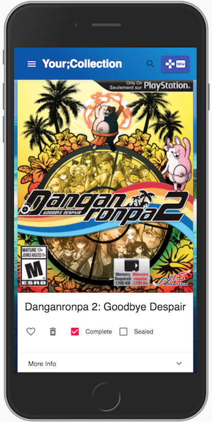
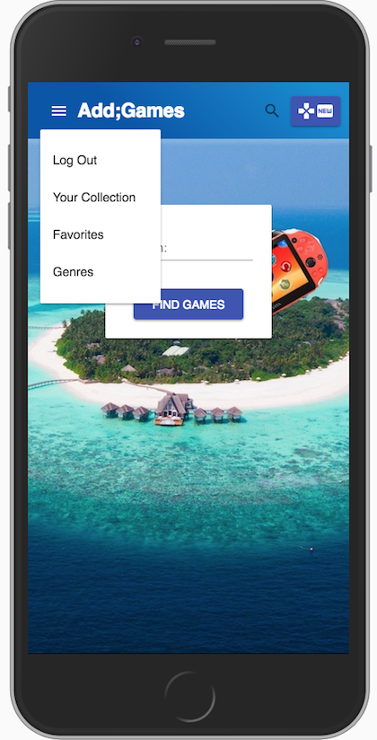

# VITA;island

A Mobile-friendly app for collectors of physical video games for the PlayStation Vita.  Users can add games to their virtual collection using information from the IGDB API.  They can organize their collecion by genre and favorites.

## Built With

React, Material UI, PostgreSQL, Node, Express, Redux, IGDB API

## Getting Started

These instructions will get you a copy of the project up and running on your local machine for development and testing purposes. See deployment for notes on how to deploy the project on a live system.

### Prerequisites

Please make sure you have the following installed on your computer.

- [Node.js](https://nodejs.org/en/)
- [PostgreSQL](https://www.postgresql.org/)
- [Nodemon](https://nodemon.io/)

### Installing

Please create database 'vita' and run the following SQL queries.
Genres are lined up with the IGDB API ('taco' is any unused genre numbers).

```sql
CREATE TABLE person (
    id SERIAL PRIMARY KEY,
    username VARCHAR (80) UNIQUE NOT NULL,
    password VARCHAR (1000) NOT NULL
);

CREATE TABLE genre (
	id SERIAL PRIMARY KEY,
	name VARCHAR(120)  NOT NULL
);

CREATE TABLE game (
	id SERIAL PRIMARY KEY,
	title VARCHAR (120) NOT NULL,
	favorite BOOLEAN NOT NULL,
	genre_id INT REFERENCES genre NOT NULL,
	person_id INT REFERENCES person NOT NULL,
	image_url VARCHAR (2005),
	complete BOOLEAN,
	sealed BOOLEAN,
	description VARCHAR (5000),
	plu INTEGER
);

INSERT INTO genre (name)
VALUES ('Action'),
('Point and Click'),
('taco'),
('Fighting'),
('Shooter'),
('taco'),
('Music'),
('Platformer'),
('Puzzle'),
('Racing'),
('Real-Time-Strategy'),
('RPG'),
('Simulator'),
('Sports'),
('Strategy'),
('Turn-Based-Strategy'),
('taco'),
('taco'),
('taco'),
('taco'),
('taco'),
('taco'),
('taco'),
('Tactical'),
('Hack ''n'' Slash/Beat ''em Up'),
('Quiz/Trivia'),
('taco'),
('taco'),
('taco'),
('Pinball'),
('Adventure'),
('Indie'),
('Arcade'),
('Visual Novel');
```

## Screen Shots




### Completed Features

- [x] Add to your collection via game information from IGDB API
- [x] View your collection by genre or personal favorites
- [x] Mark games as "complete" or "sealed" to keep track of collectabilty.
- [x] Local search option to search your personal collection by title.

### Next Steps

- [ ] Next version in React Native. 
- [ ] Ability to connect your user to your PSN profile via [PSN API](https://www.psnleaderboard.com/)
- [ ] Look up games via barcode scan with [Barcode to PC](https://barcodetopc.com/) open source app.

## Authors

* Cory Booth


## Acknowledgments

* [IGDB API](https://igdb.github.io/api/)